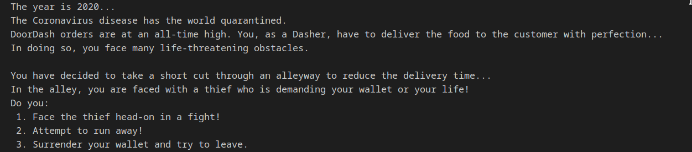

# CutieHack2020 - Doordash Survival

<!-- PROJECT LOGO -->
 

  

  <h3 align="center"></h3>

  

    An awesome RPG game to play during the COVID-19 pandemic!
     
    <a href="https://youtu.be/5XCbzeu5Id4"><strong>View Demo</strong></a>
     
     
    <a href="https://github.com/DhillonSuhail/CutieHack2020/">Explore the docs »</a>
    ·
    <a href="https://github.com/DhillonSuhail/CutieHack2020/issues">Report Bug</a>
    ·
    <a href="https://github.com/DhillonSuhail/CutieHack2020/issues">Request Feature</a>
  

<!-- ABOUT THE PROJECT -->
## About The Project

  

## Inspiration
We figured that because people are staying at home during this pandemic they are likely ordering more food through apps like Uber Eats and Door Dash. With this in mind, we wanted to make a slightly exaggerated and satirical take on the state of the Door Dash driver during the times of corona virus.

## What it does
Door Dash Survival is a text-based rouge-like RPG centered around a Door Dash driver attempting to deliver an order. As he makes his journey he is presented with challenges he must overcome ranging from getting lost on his way to the customer's home to getting jumped in an alleyway.

## How we built it
In order to build Door Dash Survival we worked with github to work collaboratively on the various aspects of the game. Aside from github we used traditional c++ object-oriented programming.

<!-- GETTING STARTED -->
### Prerequisites

GCC or alternative C++ compiler

### Installation

1. Compile the code
2. Run

## Contributors
*[Suhail Dhillon](https://github.com/DhillonSuhail)
*[Gurman Dhaliwal](https://github.com/gsinghd)
*[Lorenzo Gonzales](https://github.com/lorenzog1)
*[Albert Sanchez](https://github.com/Albertsanchez700)

## Challenges we ran into
Initially we struggles to work with github and encountered several instances where changes would not push or pull correctly. As we came to understand how github functions the only other real issue we encountered was calls happening to often or not at they should, which were solved through careful analysis of the code with work arounds being found or errors patched.

## Accomplishments that we're proud of
We are especially proud of two accomplishments through the development of this project. The first is figuring out how to use github properly without attending the workshop or watching online tutorials. The second is learning how to implement different classes, methods, and constructors into a c++ program.

## What we learned
We learned how to properly use github to share our work and work effectively as a team. We also learned how to effectively implement classes, methods, and constructors to simplify and organize code while reducing redundant code in a program. The final thing we learned is how to (relatively) painlessly introduce user interactivity and decision-making.

## What's next for Door Dash Survival
World Conquest. We shall rise to the top just as Flappy Bird before us.

